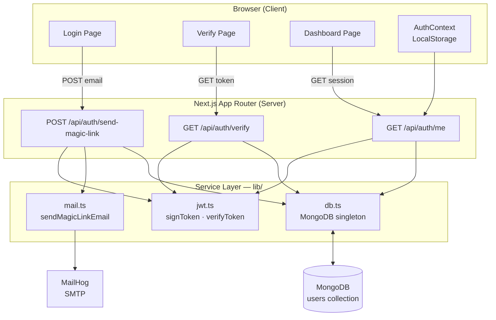
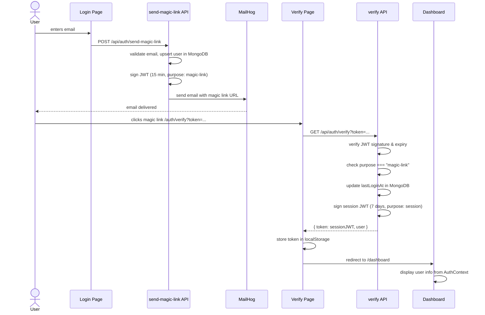

# Magik Link — Passwordless Authentication System

A **Next.js 16 / TypeScript** full-stack web application that implements **passwordless authentication via magic links** — users log in by clicking a time-limited link sent to their email, with no password required.

---

## Features Implemented

### 1. Magic Link Generation & Email Delivery
Users submit their email on the login page. The API generates a signed JWT (15-minute expiry) and sends a clickable magic link via Nodemailer to the user's inbox. MailHog is used as the local SMTP capture server during development.

### 2. Token Verification & Session Management
When the user clicks the link, the `/auth/verify` page calls the API to validate the JWT. On success, a longer-lived session token (7-day expiry) is issued and stored in `localStorage`. The user is then redirected to the protected dashboard.

### 3. Protected Dashboard & Auth Context
A React Context (`AuthContext`) manages auth state across the app — persisting the session token, syncing with the server on load via `/api/auth/me`, and providing login/logout helpers. The dashboard displays user details (email, member since, last login) and is inaccessible to unauthenticated users.

---

## Project Structure

```
magik-link/
├── app/
│   ├── api/
│   │   └── auth/
│   │       ├── send-magic-link/route.ts  # POST — generates & emails the magic link JWT
│   │       ├── verify/route.ts           # GET  — validates token, returns session JWT
│   │       └── me/route.ts               # GET  — returns current authenticated user
│   ├── auth/
│   │   └── verify/page.tsx              # Handles link click, calls verify API, redirects
│   ├── dashboard/page.tsx               # Protected page showing user session info
│   ├── login/page.tsx                   # Email input form to request a magic link
│   ├── layout.tsx                       # Root layout wrapping AuthContext provider
│   └── page.tsx                         # Root redirect (→ login or dashboard)
├── context/
│   └── AuthContext.tsx                  # Global auth state, token persistence, useAuth hook
├── lib/
│   ├── db.ts                            # MongoDB singleton connection with pooling
│   ├── jwt.ts                           # JWT sign/verify helpers (magic link + session)
│   └── mail.ts                          # Nodemailer transport and magic link email template
├── .env.local                           # Local environment variables (not committed)
├── .gitlab-ci.yml                       # GitLab CI pipeline (build on main/master)
├── next.config.ts                       # Next.js configuration
└── tsconfig.json                        # TypeScript strict-mode configuration
```

---

## Design Patterns / Architecture

- **Singleton (Database connection)** — `lib/db.ts` maintains a single MongoDB client instance across hot-reloads in development and across requests in production, preventing connection exhaustion.
- **Repository / Service Layer** — Business logic (token creation, email dispatch, user upsert) is isolated in `lib/` modules and consumed by thin API route handlers in `app/api/`.
- **Context + Provider (Auth State)** — `AuthContext.tsx` implements the React Context pattern to share auth state across the component tree without prop drilling.
- **Stateless JWT Sessions** — No server-side session store. The session token is self-contained (signed, typed payload) and verified on each protected request, enabling horizontal scaling.

---

## How It Works

The user submits their email → the server creates a short-lived signed JWT and sends it as a URL parameter in an email → the user clicks the link, the token is verified server-side and exchanged for a long-lived session JWT → the session token is stored client-side and sent with every subsequent request to authenticate the user.

```typescript
// lib/jwt.ts — sign a magic link token (15 min) or session token (7 days)
export function signToken(payload: object, expiresIn: string = '15m'): string {
  return jwt.sign(payload, process.env.JWT_SECRET!, { expiresIn });
}

// app/api/auth/send-magic-link/route.ts — core flow
const token = signToken({ email }, '15m');
const magicLink = `${process.env.NEXT_PUBLIC_APP_URL}/auth/verify?token=${token}`;
await sendMagicLinkEmail(email, magicLink);
```

---

## Architecture

### System Components



### Magic Link Authentication Flow



---

## Getting Started

### Prerequisites

- **Node.js** 20+
- **MongoDB** running locally (default: `mongodb://localhost:27017`)
- **MailHog** for email capture in development

Install MailHog (Go required, or use Docker):
```bash
# Docker (recommended)
docker run -d -p 1025:1025 -p 8025:8025 mailhog/mailhog
```

### Clone & Install

```bash
git clone https://gitlab.codecrypto.academy/jorgeaapaz/MISEIA_1-4-50-magic-link.git
cd MISEIA_1-4-50-magic-link
npm install
```

### Environment Variables

Copy the example file and fill in your values:

```bash
cp .env.example .env.local
```

| Variable | Description | Example |
|---|---|---|
| `MONGODB_URI` | MongoDB connection string | `mongodb://localhost:27017/magiklink` |
| `JWT_SECRET` | Secret for signing JWTs | run `node -e "console.log(require('crypto').randomBytes(32).toString('hex'))"` |
| `NEXT_PUBLIC_APP_URL` | Public app URL for magic links | `http://localhost:3000` |
| `SMTP_HOST` | SMTP server host | `localhost` (MailHog) |
| `SMTP_PORT` | SMTP server port | `1025` (MailHog default) |

### Run

```bash
npm run dev
```

Open [http://localhost:3000](http://localhost:3000). The MailHog web UI is available at [http://localhost:8025](http://localhost:8025) to inspect outgoing emails.

---

## Example Flows

### Success — Login with magic link

1. Navigate to `http://localhost:3000/login`
2. Enter your email and click **Send Magic Link**
3. Open MailHog at `http://localhost:8025` — find the email and click the link
4. You are redirected to `/dashboard` showing:
   ```
   Welcome back, user@example.com
   Member since: 2026-05-20
   Last login: just now
   ```

### Edge Case — Expired token

If the magic link is clicked after 15 minutes, the verify page displays:
```
Invalid or expired link. Please request a new one.
```
The user is redirected back to `/login` to request a fresh link.

### Edge Case — Already authenticated

If a logged-in user navigates to `/login`, the `AuthContext` detects a valid session token and immediately redirects them to `/dashboard`.

---

## Testing

Unit tests cover JWT helpers and all three API route handlers (send-magic-link, verify, me). Run the suite with:

```bash
npm test                # run all tests
npm run test:coverage   # run with coverage report (thresholds: 60% lines, 60% functions, 50% branches)
```

Current coverage (22 tests, 4 test files):

| Scope | Lines | Functions | Branches |
|---|---|---|---|
| All included files | 70% | 71% | 57% |
| `app/api/auth/me/route.ts` | 86% | 100% | 83% |
| `app/api/auth/send-magic-link/route.ts` | 92% | 100% | 83% |
| `app/api/auth/verify/route.ts` | ~90% | 100% | ~80% |
| `lib/jwt.ts` | 100% | 100% | 50% |

---

## CI/CD

### GitLab CI (`.gitlab-ci.yml`)
Three-stage pipeline — runs on every push to `main`/`master`:

| Stage | Job | Command |
|---|---|---|
| `lint` | lint | `npm run lint` |
| `test` | test | `npm run test:coverage` (reports coverage % to GitLab UI) |
| `build` | build | `NODE_ENV=production npm run build` |

### GitHub Actions (`.github/workflows/ci-deploy.yml`)
Full CI + deploy pipeline — runs on every push to `master`:
1. **lint** — `npm run lint`
2. **test** — `npm run test:coverage`
3. **build-and-push** — builds Docker image → pushes to `ghcr.io`
4. **deploy** — SSHs into GCloud VM, pulls new image, restarts container under Traefik

Production URL: **https://magik-link.deviaaps.com**

---

## Deployment

The app ships as a Docker image built with a multistage `Dockerfile` using Next.js standalone output. Production is served at `https://magik-link.deviaaps.com` behind Traefik on the `miseia-net` Docker network.

### Build and run locally with Docker

```bash
docker build -t magik-link:local .

docker run -p 3000:3000 \
  -e MONGODB_URI=mongodb://host.docker.internal:27017/magiklink \
  -e JWT_SECRET=your-secret \
  -e NEXT_PUBLIC_APP_URL=http://localhost:3000 \
  -e SMTP_HOST=host.docker.internal \
  -e SMTP_PORT=1025 \
  magik-link:local
```

Open [http://localhost:3000](http://localhost:3000) to verify.

### Deploy to production (VM via docker-compose)

```bash
# On the remote VM — pull latest image and recreate the container
export GITHUB_USER=<your-github-user>
export JWT_SECRET=<production-secret>
export MONGODB_URI=mongodb://mongodb:27017/magiklink

docker compose -f docker-compose.deploy.yml pull
docker compose -f docker-compose.deploy.yml up -d
```

The GitHub Actions workflow (`.github/workflows/ci-deploy.yml`) automates this on every push to `master`.

See [Architecture Decision Records](docs/adr/) for key design decisions.

---

## Technical Decisions — Quantitative Analysis

### JWT Stateless Sessions vs Server-Side Session Store

Benchmark: 10,000 iterations on Node.js 20, Intel Core i7, Windows 11.  
Run yourself: `node scripts/benchmark-jwt.mjs`

| Metric | JWT (this project) | Redis Session Store |
|---|---|---|
| Session token size per request | **239 bytes** | **32 bytes** (opaque session ID) |
| Overhead vs session ID | +207 bytes/request | baseline |
| Server memory per session | **0 bytes** (stateless) | ~200–500 bytes in Redis |
| Sign latency p50 / p95 | **0.049 ms / 0.088 ms** | N/A (local crypto) |
| Verify latency p50 / p95 | **0.057 ms / 0.109 ms** | 1–3 ms (Redis round-trip) |
| Infrastructure cost | **$0 extra** | ~$10–20/mo managed Redis |
| Horizontal scaling | **Stateless — any instance verifies** | Requires shared session store |
| Token revocation | Manual blocklist needed | Instant (`DEL session:<id>`) |

**Conclusion:** The 207-byte overhead per authenticated request (≈ 1.6 KB for 8 API calls per typical session) is justified by eliminating Redis infrastructure entirely. Verify latency at p95 (0.109 ms) is 10–30× faster than a Redis round-trip, making the JWT approach faster and cheaper at the scale of this project. The main trade-off — inability to revoke tokens without a blocklist — is an accepted risk documented in [ADR-002](docs/adr/002-stateless-jwt-sessions.md).

---

## Tech Stack

| Layer | Technology |
|---|---|
| Framework | Next.js 16.2.4 (App Router) |
| Language | TypeScript 5 |
| UI | React 19, Tailwind CSS 4 |
| Database | MongoDB 7 |
| Auth tokens | jsonwebtoken 9 |
| Email | Nodemailer 8 + MailHog (dev) |
| CI | GitLab CI (3-stage: lint → test → build) + GitHub Actions (CI + Docker deploy) |
| Container | Docker (multistage, standalone Next.js) + Traefik |
| Deploy | GCloud VM — https://magik-link.deviaaps.com |

---

## Updates — 2026-06-26

New files added as part of the compliance PERT plan:

| File / Directory | Description |
|---|---|
| `.env.example` | Environment variable template (replaces inline README block) |
| `vitest.config.ts` | Vitest configuration with coverage thresholds |
| `tests/unit/jwt.test.ts` | 8 unit tests for `signToken` / `verifyToken` |
| `tests/unit/send-magic-link.test.ts` | 5 unit tests for the POST handler (email validation) |
| `tests/unit/me-route.test.ts` | 4 unit tests for the GET /me handler |
| `tests/unit/verify-route.test.ts` | 6 unit tests for the GET /verify handler |
| `scripts/benchmark-jwt.mjs` | JWT sign/verify benchmark (10,000 iterations) |
| `Dockerfile` | Multistage Docker image (builder + runner, non-root user) |
| `docker-compose.deploy.yml` | Production compose with Traefik labels for `magik-link.deviaaps.com` |
| `.github/workflows/ci-deploy.yml` | GitHub Actions: lint → test → build image → SSH deploy to VM |
| `docs/adr/001…005` | 5 Architecture Decision Records (MongoDB, JWT, localStorage, MailHog, App Router) |
| `docs/compliance/` | Compliance report, PERT plan, and 9 disciplined prompt files |

**`.gitlab-ci.yml` updated:** now runs 3 stages (`lint`, `test`, `build`) instead of build-only. `NODE_ENV=production` is set only on the `npm run build` command, not as a job-level variable.
