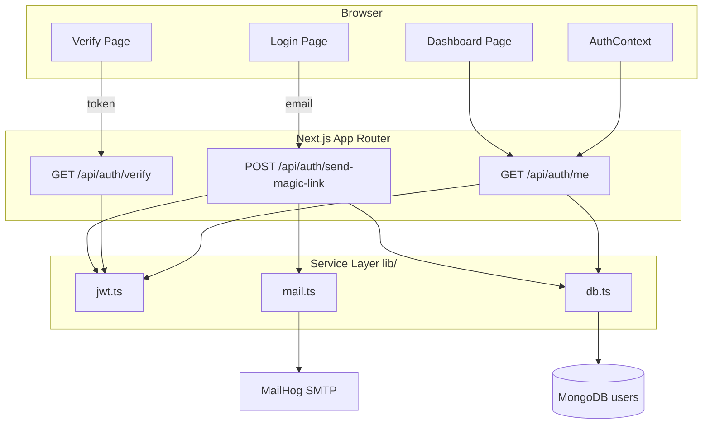
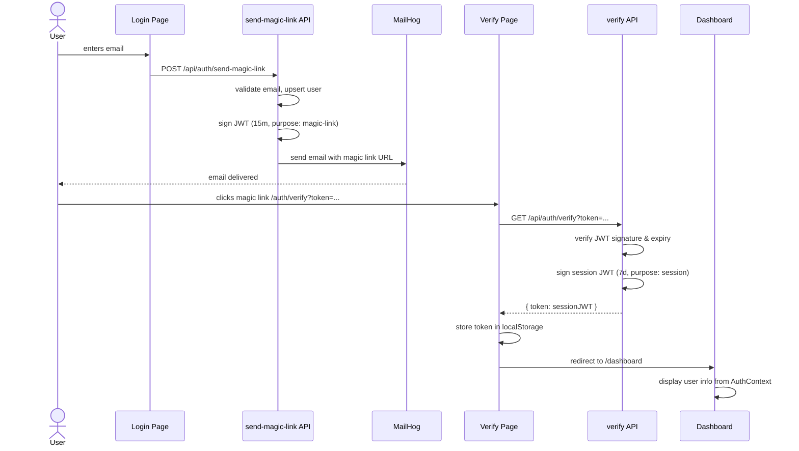

@~/.claude/prompts/new_functionality_prompt_spec.md

# Add Architecture Diagram to README

## Role
Act as a Software Architect expert in system documentation.

## Context
Project: **Magik Link** — Next.js 16 passwordless auth system.  
Location: `D:\Master-IA-Dev\04-Bloque4\1-4-50-magic-link\magik-link`  
Non-compliant item: `dc_diagrama_arquitectura`

The README has good textual descriptions but no visual architecture diagram. The system has the following components:
- **Browser client** (React/Next.js pages: login, verify, dashboard)
- **Next.js API Routes** (3 handlers: send-magic-link, verify, me)
- **lib/** (jwt.ts, mail.ts, db.ts service layer)
- **MongoDB** (users collection: email, createdAt, lastLoginAt)
- **SMTP / MailHog** (email delivery)
- **AuthContext** (client-side session state via localStorage)

Key flows:
1. Login flow: Browser → POST /api/auth/send-magic-link → lib/mail → MailHog → Browser email
2. Verify flow: Browser (click link) → GET /api/auth/verify → lib/jwt → localStorage
3. Session flow: Browser → GET /api/auth/me → lib/jwt → MongoDB user data

## Task
Add a **Mermaid diagram** to `README.md` that shows:
1. The component diagram (system architecture)
2. The authentication sequence diagram (magic link flow)

### Diagram Guidelines
- Use Mermaid syntax (GitHub renders it natively)
- Component diagram: show Browser, Next.js App Router, API Routes, lib/ services, MongoDB, MailHog
- Sequence diagram: show the complete magic link flow (request → email → click → session)
- Keep it readable — no more than 20 nodes in the component diagram
- Insert after the "How It Works" section in README.md

## Output Format
Insert this section into README.md after "How It Works":

```markdown
## Architecture

### System Components


```

### Magic Link Authentication Flow


```

## Steps to Follow
1. Read current `README.md`.
2. Find "How It Works" section.
3. Insert the two Mermaid diagrams after it.
4. Commit: `docs: add architecture and sequence diagrams`.

## Output Checklist and Guardrails
- [ ] Component diagram added with all major system components
- [ ] Sequence diagram shows complete magic link flow
- [ ] Mermaid syntax is valid (test at mermaid.live)
- [ ] Diagrams inserted at the right place in README.md
- [ ] No other README content modified
